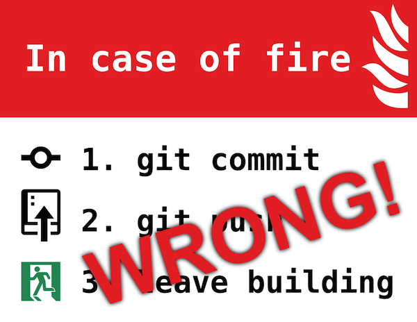

# git-evac

紧急撤离用 Git 子命令



在紧急情况下，手动输入 `git commit` 和 `git push` 是不明智的，你可能需要额外花费精力**输入评论**和处理任何可能的
**代码冲突**。

真正的编程侠是不会允许这种不严谨的做法的。

在此介绍 `git evac`。

## 亮点

使用 `Go` 语言实现，完全无运行时依赖。

你甚至能够在不小心弄丢了你的 `git` 可执行命令的情况下，保护你的代码。

## 安装

你可以从源代码安装，也可以下载预先编译好的二进制命令。

* 从源代码安装

  ```shell
  git clone https://github.com/guoyk93/git-evac.git
  cd git-evac
  go build -o git-evac
  ```

* 下载预先编译好的二进制命令

  访问 https://github.com/guoyk93/git-evac/releases 选择正确的操作系统和系统构架

任何一种方法都需要你将可执行程序放置在 PATH 目录下。

```shell
chmod +x git-evac
sudo mv -f git-evac /usr/local/bin/git-evac
```

## 使用

一旦起火，你只需要输入 `git evac` 或者 `git-evac` 然后快速离开建筑物。

`git-evac` 会帮助你:

1. 托管所有变更
2. 切换到全新的分支
3. 创建提交，并填写评论
4. 推送分支到远程服务器

## 赞助


## 许可证

Guo Y.K., MIT License